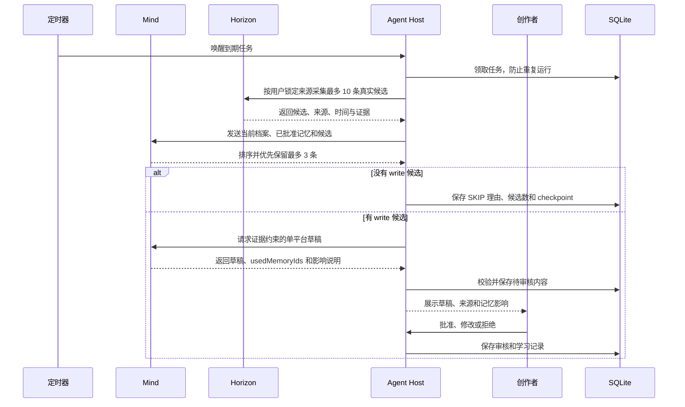

# X News Toolbox

A persistent, human-in-the-loop content intelligence agent for creators. A Mind decides when to scan, what is worth writing, and how to prepare platform-ready drafts while the creator keeps final control.

Built for **Creative Minds Jam #1 — Audience Growth & Engagement**.

## Mind-first 调用流程

> 定时器只负责唤醒；Agent 按用户锁定来源采集最多 10 条候选，Mind 负责筛选、排序、决定是否成稿以及如何写作。
> 输出平台不与赛道绑定。创作者可为每次任务选择 X 或小红书，Mind 只生成当次所选平台的一个版本。



## The problem it solves

Creators often jump between feeds, accounts, notes, and AI tools just to find a useful story. The result is noisy research, inconsistent writing, weak evidence, and too much manual work. X News Toolbox brings that workflow into one focused desk:

- **Scattered sources:** manage RSS, Atom, JSON API, RSSHub, and X account sources in one place.
- **Too much noise:** use a pinned Horizon worker to collect, normalize, deduplicate, score, and enrich signals while preserving source links and collection times.
- **Generic AI writing:** analyze authorized X accounts and turn abstract writing traits into reusable style profiles.
- **Weak traceability:** connect drafts to versioned evidence and mark supporting, conflicting, or unverified claims.
- **Publishing risk:** require human approval, revision, or rejection; the app never posts automatically.
- **Difficult setup:** configure Mind, Horizon AI, and X credentials through a visual connection panel with clear status feedback.
- **Poor portability:** build a self-contained Windows folder that can be moved to another computer and configured by its user.

## Who it helps

X News Toolbox is designed for independent creators, newsletter writers, community operators, researchers, and small content teams who publish the same idea in different platform formats. It is especially useful for creators who need evidence-backed writing but do not want to maintain separate research notes, prompts, and editing checklists for every platform.

## Cross-platform writing support

The workspace turns one reviewed, evidence-backed idea into a platform-specific draft. The creator chooses X or Xiaohongshu before generation, so the Mind creates only the requested version. X receives a concise complete post; Xiaohongshu receives a title, body, hashtags, cover copy, and visual brief.

This helps creators:

- reduce repeated rewriting and manual character counting;
- keep the same verified facts and source links across platforms;
- adapt tone and structure without losing their personal style;
- see warnings before a draft is copied or published; and
- keep final approval in human hands with no automatic posting.

## Mind-first inbox

| Page | Purpose |
| --- | --- |
| Today | Review platform-ready drafts prepared automatically by the Mind, including reasons and sources. |
| Status | See the next wake-up, current stage, latest Mind plan, memory influence, and failures. |
| Settings | Configure the Mind, Horizon, creator baseline, locked sources, platform, output cap, and daily time. |

The previous radar, source, style, draft, result, and judging-proof routes remain available for compatibility and competition evidence, but they are no longer the default user journey.

## What the Mind does

The Mind is the decision orchestrator, not a rewriting step. After the scheduler wakes the Agent and locked sources provide up to ten candidates, the Mind ranks them, keeps at most three priority items, decides whether any item deserves a draft, produces evidence-bound platform copy, and proposes learning hypotheses from real outcomes. It explicitly reports which user-approved memory IDs influenced every later decision.

The scheduler controls only time. Horizon and local tools execute collection, persistence, validation, and review gates; they do not make semantic content decisions.

The application remains responsible for source ingestion, local persistence, permission boundaries, human review, and audit records.

## Versioned Agent governance

Every new run records the `1.0.0` Agent Contract together with deterministic input, evidence, memory, platform, risk, human-review, and publication gates. The status and proof pages expose those results, so a creator or judge can see why automation continued, stopped, or required human action. Existing SQLite checkpoints remain the single run ledger; no second Agent runtime or memory database is introduced.

## Tech stack

- Next.js 16, React 19, and TypeScript
- Node.js 22 native SQLite
- Minds Client SDK
- Horizon 0.1.0 at audited commit `80bde6db03008678111fb627b471792c7ac05a94`, connected through stdio MCP
- `twitter-api-v2`, using the official X API only
- Zod and Vitest

## Run locally

Requirements: Node.js 22+, Python 3.11+, and pnpm.

```powershell
Copy-Item .env.example .env.local
pnpm install
powershell -ExecutionPolicy Bypass -File scripts/bootstrap-horizon.ps1 -PythonExe C:\path\to\python.exe
pnpm dev
```

Open `http://localhost:3000`, then use **Connections** to add your own credentials. The repository contains no real API keys, runtime databases, or personal configuration.

For a headless first-time setup on Windows, run:

```powershell
powershell -ExecutionPolicy Bypass -File scripts/setup-agent.ps1
```

The wizard asks only for user-controlled credentials, writes them to the Git-ignored `.env.local`, and generates the Agent Tool bearer secret. After deployment, register [the OpenAPI tool contract](openapi/agent-tools.yaml) with the deployed HTTPS base URL. The Mind can then call `getAgentStatus`, ask the creator for non-secret preferences, and call `configureAgentPreferences` once. It cannot configure, read, or return API keys.

The complete split is:

- **User:** credentials, deployment authorization, paid API consent, and final publishing.
- **Mind:** positioning, audience, voice, boundaries, platform, focus, output cap, schedule, and post-install self-check.
- **Agent host:** collection, persistence, validation, retries, and human-review gates.

The visual settings page can also store configuration locally. In portable mode, those settings stay inside that portable copy's own `data` directory and do not inherit credentials from the host computer.

## Run as a headless Agent

The production Agent does not require the website or port 3000:

```powershell
pnpm build:agent
node dist/agent/cli.mjs validate
node dist/agent/cli.mjs run-due
node dist/agent/cli.mjs status
```

On Windows, preview and then install the daily 10:00 task:

```powershell
powershell -ExecutionPolicy Bypass -File scripts/install-agent-schedule.ps1 -Preview
powershell -ExecutionPolicy Bypass -File scripts/install-agent-schedule.ps1
powershell -ExecutionPolicy Bypass -File scripts/verify-agent-schedule.ps1
```

The operating system only wakes the CLI. SQLite claims the due task and prevents duplicates; the Mind decides which collected candidates deserve writing or whether the completed run should be recorded as SKIP. The CLI sends a short Windows notification for completed, skipped, or failed runs. The in-process Next.js poller is disabled unless `CREATOR_MIND_ENABLE_IN_PROCESS_SCHEDULER=1` is explicitly set.

## Build the Windows portable edition

```powershell
pnpm portable
```

The output is written to `dist/x-news-toolbox-portable-*`. It includes Node, Python, and the pinned Horizon worker. Copy the generated folder to another Windows computer, run `start.cmd`, and let that user configure their own connections and sources. The build script blocks `.env` files, runtime configuration, and SQLite databases from entering the portable package.

## Verify

```powershell
pnpm verify
```

This runs the test suite, TypeScript checks, and the production build.

Additional project material:

- [Architecture](docs/architecture.md)
- [Three-minute demo script](docs/demo-script.md)
- [DoraHacks submission material](docs/submission-pack.md)
- [Open-source wheel research and technical selection](docs/research/github-wheel-comparison.md)
- [Mind-first architecture decision](docs/mind-first-agent-decision.md)
- [Mind Skill and Tool API contract](docs/mind-skill.md)
- [Agent call flow](docs/agent-call-flow.md)

## Safety and privacy

- The app never publishes, replies, likes, or follows automatically; the creator makes every final action.
- X features use the official API and remain subject to developer-account access, rate limits, and platform policy.
- Horizon's Apify/Playwright Twitter collection is disabled; X account sources remain on the official X API adapter.
- A style profile can be created only after the user confirms that they are authorized to analyze the account.
- Style profiles store abstract traits, IDs, and hashes rather than long-term copies of post text, and they do not infer sensitive attributes.
- API keys are used server-side. `.env.local`, runtime configuration, local databases, dependencies, logs, and build artifacts are excluded from Git.
- The SQLite design targets local and portable use. A multi-user cloud deployment would require account isolation and managed persistence.

## License

The application source is available under the [MIT License](LICENSE). The current `@animocabrands/minds-client-lib@0.1.3` package identifies itself as `UNLICENSED` private-alpha tooling; confirm public redistribution and competition use with Minds/Animoca before publishing a public release. Horizon's bundled notice remains in [licenses/Horizon-MIT.txt](licenses/Horizon-MIT.txt).
