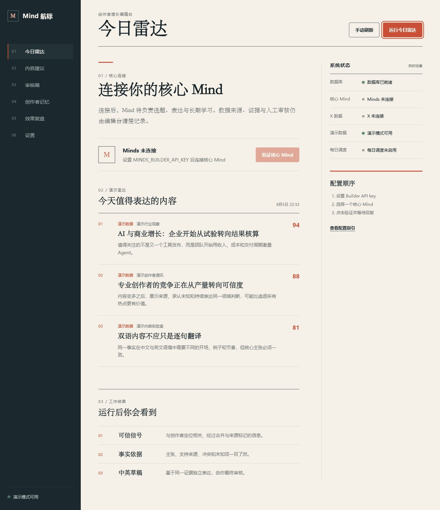

# X News Toolbox

A local AI workspace for X (Twitter) creators. It turns scattered sources into traceable story opportunities, uses a Mind to rank and reason about them, and keeps the creator in control of every final decision.

Built for **Creative Minds Jam #1 — Audience Growth & Engagement**.



## The problem it solves

Creators often jump between feeds, accounts, notes, and AI tools just to find a useful story. The result is noisy research, inconsistent writing, weak evidence, and too much manual work. X News Toolbox brings that workflow into one focused desk:

- **Scattered sources:** manage RSS, Atom, JSON API, RSSHub, and X account sources in one place.
- **Too much noise:** use a pinned Horizon worker to collect, normalize, deduplicate, score, and enrich signals while preserving source links and collection times.
- **Generic AI writing:** analyze authorized X accounts and turn abstract writing traits into reusable style profiles.
- **Weak traceability:** connect drafts to versioned evidence and mark supporting, conflicting, or unverified claims.
- **Publishing risk:** require human approval, revision, or rejection; the app never posts automatically.
- **Difficult setup:** configure Mind, Horizon AI, and X credentials through a visual connection panel with clear status feedback.
- **Poor portability:** build a self-contained Windows folder that can be moved to another computer and configured by its user.

## Workspace

| Page | Purpose |
| --- | --- |
| Signal Radar | Run the agent across selected sources and review deduplicated, ranked signals. |
| Sources | Add, test, enable, or disable RSS, Atom, JSON, RSSHub, and X sources. |
| Style Profiles | Analyze authorized X accounts and store abstract tone and writing traits. |
| Drafts | Generate Chinese or English suggestions from evidence and the active style profile. |
| Results | Record reviews, final copy, published links, and optional performance metrics. |
| Connections | Configure the Mind ID, Minds API key, Horizon AI provider, and X API credentials, and inspect connection status. |

## What the Mind does

The Mind is more than a rewriting prompt. It acts as the long-term decision layer for the creator workflow. It combines the creator profile, review history, and active style profile to rank candidate signals, explain why a topic matters, and produce traceable draft suggestions from the same evidence set.

The application remains responsible for source ingestion, local persistence, permission boundaries, human review, and audit records.

## Tech stack

- Next.js 16, React 19, and TypeScript
- Node.js 22 native SQLite
- Minds Client SDK
- Horizon 0.1.0 at audited commit `80bde6db03008678111fb627b471792c7ac05a94`, connected through stdio MCP
- `twitter-api-v2`, using the official X API only
- Zod and Vitest

## Run locally

Requirements: Node.js 22+, Python 3.11+, and pnpm.

```powershell
Copy-Item .env.example .env.local
pnpm install
powershell -ExecutionPolicy Bypass -File scripts/bootstrap-horizon.ps1 -PythonExe C:\path\to\python.exe
pnpm dev
```

Open `http://localhost:3000`, then use **Connections** to add your own credentials. The repository contains no real API keys, runtime databases, or personal configuration.

The visual settings page can also store configuration locally. In portable mode, those settings stay inside that portable copy's own `data` directory and do not inherit credentials from the host computer.

## Build the Windows portable edition

```powershell
pnpm portable
```

The output is written to `dist/x-news-toolbox-portable-*`. It includes Node, Python, and the pinned Horizon worker. Copy the generated folder to another Windows computer, run `start.cmd`, and let that user configure their own connections and sources. The build script blocks `.env` files, runtime configuration, and SQLite databases from entering the portable package.

## Verify

```powershell
pnpm verify
```

This runs the test suite, TypeScript checks, and the production build.

Additional project material:

- [Architecture](docs/architecture.md)
- [Three-minute demo script](docs/demo-script.md)
- [DoraHacks submission material](docs/submission-pack.md)
- [Open-source wheel research and technical selection](docs/research/github-wheel-comparison.md)

## Safety and privacy

- The app never publishes, replies, likes, or follows automatically; the creator makes every final action.
- X features use the official API and remain subject to developer-account access, rate limits, and platform policy.
- Horizon's Apify/Playwright Twitter collection is disabled; X account sources remain on the official X API adapter.
- A style profile can be created only after the user confirms that they are authorized to analyze the account.
- Style profiles store abstract traits, IDs, and hashes rather than long-term copies of post text, and they do not infer sensitive attributes.
- API keys are used server-side. `.env.local`, runtime configuration, local databases, dependencies, logs, and build artifacts are excluded from Git.
- The SQLite design targets local and portable use. A multi-user cloud deployment would require account isolation and managed persistence.
