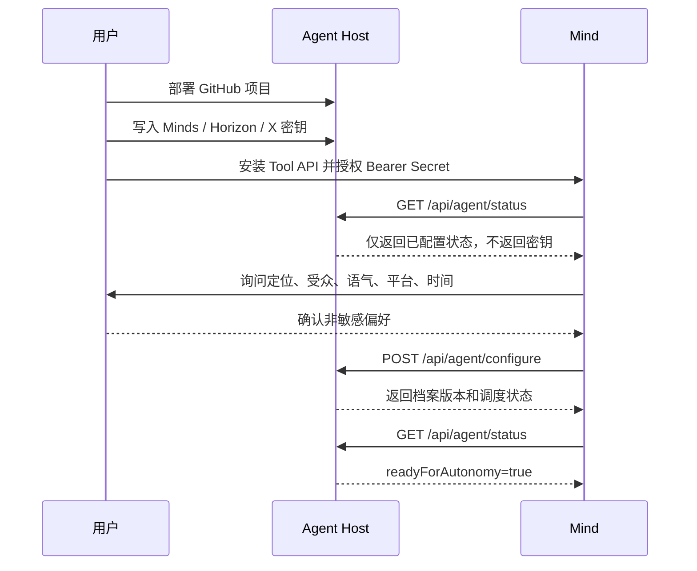
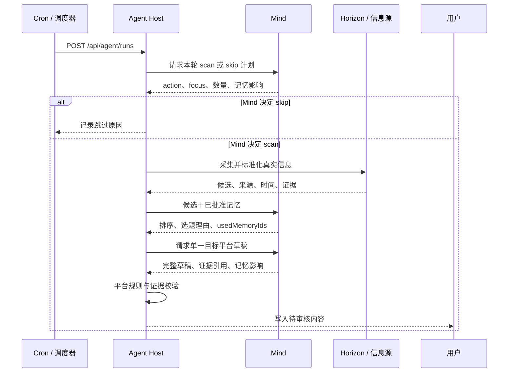
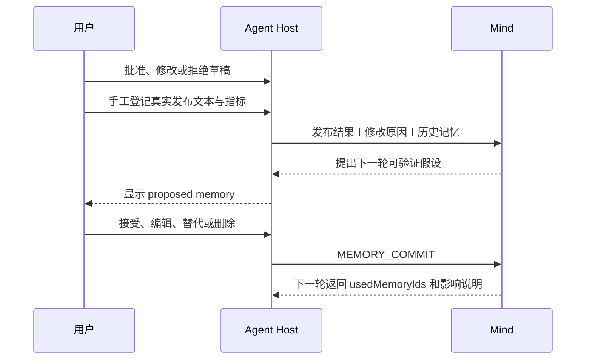

# X News Toolbox Agent 调用流程

本文说明用户、Mind、X News Toolbox Agent Host、Horizon 和外部信息源之间的真实调用关系。

## 1. 首次安装与自配置



用户必须亲自提供：API Key、部署权限、付费授权和发布权限。Mind 只能配置创作者画像、目标平台、关注方向、输出上限和每日时间。

## 2. 每日自动运行



调度器只负责唤醒；是否扫描、选什么、如何表达由 Mind 决定。Agent 可以自主准备草稿，但不能自动发布、回复、点赞、转发或关注。

## 3. 审核、发布与记忆回流



SQLite 是审计事实源；只有用户接受的记忆才能进入下一轮。Mind 返回未知或未批准的记忆 ID 时，本轮结果会被拒绝。

## 4. Tool API 顺序

| 阶段 | 方法 | 接口 | 调用方 |
| --- | --- | --- | --- |
| 自检 | `GET` | `/api/agent/status` | Mind / 部署检查 |
| 自配置 | `POST` | `/api/agent/configure` | Mind |
| 自动唤醒 | `POST` | `/api/agent/runs` | Cron / Mind |
| 查看候选 | `GET` | `/api/agent/signals` | Mind |

生产环境的以上接口统一使用：

```http
Authorization: Bearer <CREATOR_MIND_CRON_SECRET>
```

完整请求结构见 [`openapi/agent-tools.yaml`](../openapi/agent-tools.yaml)。云端 Mind 必须调用已经部署的 HTTPS 地址，不能访问用户电脑上的 `localhost`。

## 5. 失败恢复

- Mind 未连接：停止启用真实自动任务，等待用户配置密钥。
- Mind 超时：保留已采集信息和 checkpoint，从失败阶段重试。
- 单一来源失败：保留其他真实来源并记录警告。
- 平台校验失败：要求 Mind 最多重写两次，禁止直接截断句子。
- 发布动作：始终交给用户，不进入自动重试。
