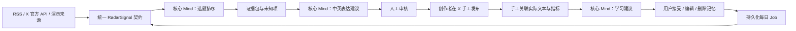

# X News Toolbox 架构说明

## 核心闭环

## 模块边界

- `CreatorDesk`：唯一业务入口，负责流程、幂等键、版本冲突和安全门。
- `MindAuthority`：Minds Builder API 的隔离边界，负责选题、表达与学习三类语义判断。
- `SignalSource`：RSS、X 官方 API 和演示数据共享的来源契约；每条信号都带 URL、时间和 `synthetic` 标记。
- SQLite Stores：保存创作者基线、雷达、证据、审核、发布关联与学习版本。
- Daily Follow-up：单例 SQLite Job 负责领取到期任务；Next.js 进程 worker 与受密钥保护的托管 cron 共用同一公开命令，原子领取避免重复运行。
- Next.js 页面与 API：只收集输入和呈现状态，不在浏览器暴露密钥。

## 真实与演示模式

- “运行真实来源”会并行尝试已配置 RSS 与 X 官方 API；单源失败只产生中文警告。
- 所有真实来源不可用时回退固定演示信号；演示信号逐条标记 `synthetic: true`。
- Recorded Mind 只服务自动化与无凭证演练；比赛正式展示需要连接真实核心 Mind，并展示 Mind 名称、会话别名和决策标识。
- 演示发布与学习继续保留 `synthetic`，不会伪装成真实效果。

## 安全与一致性

- 批准只产生“已批准未发布”，没有自动发布接口。
- 发布关联只接受当前版本的已批准建议；重复命令幂等，旧版本提交返回冲突。
- 指标缺失是“未知”，不按 0 计算；只有公式所需字段齐全且曝光大于 0 才显示互动率。
- Mind 的学习输出先进入“建议”状态，用户可以原样接受、改写后接受或删除。
- 内容建议固化其雷达来源快照，学习记录继续通过已有 proposal/publication ID 关联；比赛证据只在三段属于同一条链时判定为就绪。
- `/api/competition-proof` 输出机器可读证明；Recorded Mind、演示来源和缺失链路都会明确降级，不会冒充真实调用。
- 真实每日跟进只有在核心 Mind 已连接时才能启用；任何模式都只准备雷达，不存在自动发布命令。
- 当前部署边界是单机或带持久卷的长驻 Node 进程；无持久磁盘的 Serverless 环境必须先替换 SQLite Store，cron 本身不能提供持久性。
