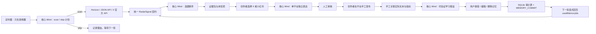

# X News Toolbox 架构说明

## 核心闭环（Mind-first）

## 模块边界

- `CreatorDesk`：唯一业务入口，负责流程、幂等键、版本冲突和安全门。
- `MindAuthority`：Minds Builder API 的隔离边界，负责自动运行计划、选题、单平台表达、学习与记忆提交五类语义判断。
- `SignalSource`：Horizon、JSON API 与 X 官方 API 共享的来源契约；每条信号都带 URL、时间、引擎元数据和 `synthetic` 标记。
- `Horizon Worker`：固定到审计提交 `80bde6db03008678111fb627b471792c7ac05a94` 的 Python stdio MCP 子进程，负责采集、评分、去重、筛选和补充背景；不拥有第二套业务数据库。
- SQLite Stores：保存含内容禁区的创作者基线、雷达、平台草稿、证据、审核、发布关联、运行 checkpoint 与可审计记忆版本。
- Daily Follow-up：单例 SQLite Job 负责到时唤醒 Mind；用户锁定平台、关注方向与输出上限，Mind 决定扫描或跳过、明确本轮 focus 和实际输出数。worker 只执行允许动作，原子领取避免重复运行。
- Next.js 页面与 API：默认只呈现今日内容、运行状态和设置；受限 Tool API 供部署后的 Mind App 调用，不在浏览器暴露密钥。

## 真实运行规则

- 手动雷达与每日任务使用同一套 Horizon/JSON/X 真实来源流水线；阶段状态持久化到 SQLite，刷新页面仍可查看。
- 真实来源不可用时可以进入明确标记的演示回退，但该运行、草稿和自主证据都只能显示为 `demo`，不能通过比赛证明。
- Horizon 自带的 Twitter/Apify/Playwright 来源显式关闭；X 账号只走现有官方 X API 适配器。
- Recorded Mind 只服务自动化与无凭证演练；比赛正式展示需要连接真实核心 Mind，并展示 Mind 名称、会话别名和决策标识。
- 演示发布与学习继续保留 `synthetic`，不会伪装成真实效果。
- 平台表达每次只生成创作者选择的一个平台。X 采用完整句校验且不得硬截断；小红书输出标题、正文、标签、封面文案和图片建议。
- 自动修订最多两次；仍不合格时保留完整原稿并开放人工编辑，保存后继续走同一套校验。
- 任务失败后从已保存阶段恢复；已采集信号不会因 Mind 超时而重复抓取。历史 checkpoint 必须标记为 `replay`。

## 安全与一致性

- 批准只产生“已批准未发布”，没有自动发布接口。
- 发布关联只接受当前版本的已批准建议；重复命令幂等，旧版本提交返回冲突。
- 指标缺失是“未知”，不按 0 计算；只有公式所需字段齐全且曝光大于 0 才显示互动率。
- Mind 的学习输出先进入“建议”状态，用户可以原样接受、改写后接受或删除。
- 只有已接受记忆能进入下一轮，每次最多五条；Mind 返回未批准的 `usedMemoryIds` 时整次结果被拒绝。
- 创作者定位、受众、稳定语气和内容禁区始终进入 Mind。平台表现记忆只在对应平台生成时召回；雷达和平台未定的提案阶段只使用全局记忆。
- 对应平台记忆优先于全局记忆。旧记忆不会被自动覆盖，只能由创作者明确保留、替代或删除。
- 接受、替代和删除分别同步为 `MEMORY_COMMIT`、`MEMORY_SUPERSEDE`、`MEMORY_DELETE`，避免稳定会话继续把撤销记忆当作有效规则。
- 内容建议固化其雷达来源快照，学习记录继续通过已有 proposal/publication ID 关联；平台草稿还必须匹配当前 proposal ID 与 evidence version，比赛证据只在整条链一致时判定为就绪。
- `/api/competition-proof` 输出 `mind-navigation-competition-proof/v2` 机器可读证明；选题、表达、学习、自主运行和记忆因果五项缺一不可。Recorded Mind、演示来源、历史回放和缺失链路都会明确降级。
- 真实每日跟进只有在核心 Mind 已连接时才能启用；任何模式都只准备待审核草稿，不存在自动发布命令。
- 比赛证明分别读取第一轮发布/学习历史与第二轮决策，不能用同一轮回用记忆冒充因果变化。
- 当前部署边界是单机或带持久卷的长驻 Node 进程；无持久磁盘的 Serverless 环境必须先替换 SQLite Store，cron 本身不能提供持久性。
