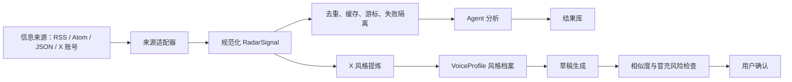

# X News Toolbox：GitHub 轮子调研与实现建议

调研日期：2026-08-08

调研范围：多信息来源、X 账号语气学习、Web 工作台子页面。

资料边界：只采用项目 GitHub 仓库、源码/许可证和 X 官方文档等一手来源。本文件只给方案，不改产品代码。

## 结论先行

最稳妥的组合不是直接套用某一个大型项目，而是保留 X News Toolbox 现有的 Next.js 16 + TypeScript + 本地 SQLite/JSON + standalone 便携架构，选择性复用三类成熟设计：

1. **信息来源层借鉴 RSSHub、Miniflux 和 Huginn**：每个地址成为独立来源，统一经过“抓取 → 规范化 → 去重 → 分析”的流水线。RSSHub 可作为外部来源转换器，但不把其完整代码嵌入本产品。
2. **X 接入直接使用 `twitter-api-v2` + X 官方 API**：通过用户名查用户 ID，再读取该用户的公开帖子时间线。官方时间线最多提供最近 3,200 条帖子，但实际可读量和费用取决于账号权限与 Developer Console 配置。
3. **P2 改成“风格档案”，不是身份克隆**：Agent 提炼句长、开头方式、节奏、标点、结构、证据偏好和 CTA 等抽象特征，再生成“参考此风格”的草稿；禁止复刻原句、签名句和冒充原作者。
4. **子页面借鉴 Dify 的职责拆分，但不引入 Dify**：Dify 功能完整但体量、部署依赖和许可证约束都不适合当前轻量便携版。
5. **不采用 `twscrape` 进入正式版本**：它依赖账号 Cookie、GraphQL 和账号轮换；X 当前服务条款明确禁止未经书面许可的抓取，正式产品应避免此风险。

推荐轮子：`twitter-api-v2` 可直接作为依赖；RSSHub 可作为用户自选的外部来源服务。其余项目主要借鉴架构和交互，不直接搬代码。

## 6 个项目对比

| 项目 | 与本需求相关的功能 | 架构与技术栈 | 许可证 | 活跃度证据（截至调研日） | 优点 / 可复用之处 | 局限 / 不适用之处 |
|---|---|---|---|---|---|---|
| [RSSHub](https://github.com/DIYgod/RSSHub) | 把大量网站和平台内容转换成 RSS；官方 README 称有 5,000+ 实例和大量路由 | TypeScript、Node.js、Hono；路由适配器 + 缓存 + 可观测性；[package.json](https://github.com/DIYgod/RSSHub/blob/master/package.json) 还能看到 Redis、Cheerio、RSS Parser 和 `twitter-api-v2` | [AGPL-3.0](https://github.com/DIYgod/RSSHub/blob/master/LICENSE) | [仓库元数据](https://api.github.com/repos/DIYgod/RSSHub) 显示 2026-08-07 仍有推送 | 最适合补充“不自带 RSS 的网站”；可借鉴“一个来源一种路由适配器”的模式；也可让用户填写自建 RSSHub 地址 | 项目巨大、依赖很多；AGPL 会影响直接合并/分发的许可策略；部分路由依赖网页结构、Cookie 或平台变化，稳定性不等同官方 API |
| [Miniflux](https://github.com/miniflux/v2) | RSS/Atom/JSON Feed、OPML、分类、全文搜索、Webhook、REST API；后台定时刷新 | Go 单体静态二进制 + PostgreSQL；少量原生 JS；使用 ETag、Last-Modified 等条件请求 | Apache-2.0 | [Releases](https://github.com/miniflux/v2/releases) 显示 2026 年持续发布 | 可直接借鉴来源表、刷新游标、条件请求、失败隔离、内容清洗与 SSRF 防护的产品语义 | Go/PostgreSQL 与当前 Next.js/便携 SQLite 路线不同；搬入整个服务会明显增加安装和运维成本 |
| [Huginn](https://github.com/huginn/huginn) | Agent 定时监控 RSS、网页、Twitter、Webhook，再产生和消费事件；事件沿有向图传播 | Ruby on Rails + MySQL/PostgreSQL；Agent/Event/Scenario 模型；Agent 可通过 Gem 扩展 | MIT | [Commits](https://github.com/huginn/huginn/commits/master/) 显示 2026-08-01 仍有提交；GitHub 最新正式 [Release](https://github.com/huginn/huginn/releases) 停在 2022 | 最值得复用的是 `Source → Event → Agent → Event` 思路：一个来源失败不拖垮其他来源，结果带来源和运行记录 | 整体应用很重；Ruby/Rails 不匹配；可视化任意工作流对本产品属于过度设计 |
| [`node-twitter-api-v2`](https://github.com/PLhery/node-twitter-api-v2) | X API v1.1/v2 的强类型封装；OAuth、用户/帖子时间线、分页器、流、错误和速率限制辅助 | TypeScript/JavaScript；零子依赖，Promise + async iterator；有缓存、令牌刷新、速率限制插件 | Apache-2.0 | [Commits](https://github.com/PLhery/node-twitter-api-v2/commits/master/) 显示 1.29.0 于 2026-01-13 更新 | 与当前 TypeScript 技术栈直接匹配；用它替换手写 X HTTP 请求，可少写分页、鉴权和错误处理代码 | 只解决 API 客户端，不解决风格提炼；可用端点、数据量、速率和费用仍完全受 X 官方权限控制 |
| [`twscrape`](https://github.com/vladkens/twscrape) | X Search/GraphQL、用户帖子、回复、媒体；多账号轮换、Cookie 会话、SQLite 限流状态 | Python 3.10+、asyncio、httpx/curl-cffi、aiosqlite；[pyproject.toml](https://github.com/vladkens/twscrape/blob/main/pyproject.toml) 当前版本 0.20.0 | MIT | 仓库当前显示 2.7k stars，主清单版本 0.20.0 | 覆盖的数据面广，账号池、端点级限流和游标设计可作为反例研究 | 需要 Python sidecar、账号 Cookie/登录、私有 GraphQL，平台改版即可能失效；README 也提醒账号与条款风险。与 [X 服务条款](https://x.com/en/tos) 中禁止未经许可抓取存在直接风险，因此正式版不采用 |
| [Dify](https://github.com/langgenius/dify) | Agent、可视化工作流、RAG、模型管理、日志/可观测性、完整 Web 控制台和 API | Python API/Worker + Next.js Web + Redis + 数据库 + 向量库 + 多容器；见 [docker-compose](https://github.com/langgenius/dify/blob/main/docker/docker-compose.yaml) | [Dify Open Source License](https://github.com/langgenius/dify/blob/main/LICENSE)：基于 Apache 2.0，但附加多租户和前端 LOGO/版权限制 | [Commits](https://github.com/langgenius/dify/commits/main/) 显示 2026-08-05 仍有密集提交 | 可借鉴“每项能力独立页面、运行记录、配置与密钥分离、工作流步骤状态”的信息架构 | 对单机便携工具过重；启动依赖多个服务；许可证不适合直接拿其前端改名；不要引入整套 Dify |

## X 官方 API 与“扫描账号语气”的边界

官方可行路径如下：

1. 用 [User Lookup](https://docs.x.com/x-api/users/lookup/introduction) 的 `GET /2/users/by/username/:username` 把 `@账号名` 换成用户 ID。
2. 用 [User Posts timeline](https://docs.x.com/x-api/posts/timelines/introduction) 的 `GET /2/users/:id/tweets` 获取公开帖子。官方文档称最多可取最近 3,200 条；排除回复时最多 800 条，并支持分页和时间过滤。
3. 使用 App-Only Bearer Token 即可读取公开用户时间线；私密指标或 Home timeline 需要用户上下文。具体鉴权矩阵见 [Timelines Integration Guide](https://docs.x.com/x-api/posts/timelines/integrate)。
4. 每次响应记录 `x-rate-limit-*` 头并做缓存、退避和游标续传。X 官方说明 [速率限制和用量计费是两件事](https://docs.x.com/x-api/fundamentals/rate-limits)，即使没触发限流也可能产生读取费用；实时价格要以 Developer Console 为准，官方 [Usage and Billing](https://docs.x.com/x-api/fundamentals/post-cap) 也明确建议设置预算和缓存。

不建议把“扫描”实现成无 API 的网页抓取。2026-04-10 生效的 [X 服务条款](https://x.com/en/tos) 明确表示，未经 X 事先书面同意，不得以抓取或爬取方式访问服务，也不得绕过技术限制。`twscrape` 虽然开源，但开源许可证并不等于平台授权。

“模仿语气”也要避免变成冒充。X 的 [真实性规则](https://help.x.com/en/rules-and-policies/authenticity) 禁止用误导性身份欺骗用户。因此产品应输出“参考风格草稿”，界面明确展示参考账号，禁止自动冒充发布；发布仍由用户确认。

这里还有一个比技术更重要的政策门槛：[X Developer Guidelines](https://docs.x.com/developer-guidelines) 把未经同意的用户画像/监控、用 X 数据训练 AI/ML、非 API 抓取，以及推断敏感属性列为禁止事项；自动发布 AI 生成回复还需要 X 事先批准。故正式 P2 应限制为**用户本人或已明确授权的账号**，首版只在一次任务中做推理时特征提取，不做微调/训练，不长期保存原帖，不推断政治、健康、宗教等属性，并只生成供人工审阅的草稿。即使如此，若要商业上线，仍应先向 X 确认该具体用例是否获准；本调研不是法律意见。

## 推荐的功能架构



### 1. 多信息来源

把当前单个 `defaultSourceUrl` 升级为来源列表，而不是简单增加多个文本框。每个来源建议包含：

```text
id, name, type, urlOrHandle, enabled, pollInterval,
authRef, lastCursor, lastCheckedAt, lastSuccessAt, lastError
```

首期来源类型：

- `rss` / `atom`：多个订阅地址。
- `json`：多个 JSON API 地址；每个来源允许配置字段映射，避免只猜 `items/data/results`。
- `x-account`：填写一个或多个 `@handle`，后台通过官方 API 转 ID 并读取帖子。
- `rsshub`：本质仍按 RSS 读取，但界面标注“由 RSSHub 转换”，便于诊断来源稳定性。

运行策略借鉴 Huginn 和 Miniflux：并发读取但限制并发数；单个来源超时/失败只记录警告；按规范化 URL 或 X Post ID 去重；保存 ETag、Last-Modified、pagination token 和最后成功时间；默认阻止内网地址、重定向到内网和 DNS rebinding，延续当前 SSRF 防护。

### 2. P2：X 账号风格扫描与参考写作

P2 不再是手填“表达方式”，而是独立的“风格档案”流程：

1. 用户选择 1–3 个本人或已获明确授权的公开 X 账号和样本范围，并记录授权确认。
2. 通过官方 API 获取样本，默认每账号 100 条；默认排除转帖，回复是否纳入由用户选择。
3. 清洗 URL、重复引用和纯媒体帖，保留换行、标点、emoji 和线程结构。
4. Agent 只提炼抽象特征：平均长度、开头钩子、句子节奏、段落密度、常见结构、观点强度、证据偏好、emoji/标签/CTA 使用习惯。
5. 保存结构化 `VoiceProfile`，同时保存样本数、扫描时间、账号和数据范围，以便重扫和审计；原始帖子只在任务期间临时处理，不作为训练集长期保存。
6. 生成草稿后做重复度检查：连续短语/n-gram 与样本过近则要求重写；不复制独特口号、签名句或事实主张；结果标记为“AI 参考风格草稿”。

这比把原始帖子全部塞进一次 Prompt 更稳定，也能复用到多个选题，并减少 API 与模型成本。

### 3. 子页面

建议把现在一个页面内的锚点/折叠区拆成真正路由：

| 路由 | 中文导航标签 | 只负责什么 |
|---|---|---|
| `/radar` | 信息扫描 | 选择来源、扫描主题、启动任务、看实时进度 |
| `/sources` | 信息来源 | 新增多个 RSS/JSON/RSSHub/X 账号，测试连接、启停、查看最后错误 |
| `/style` | 风格档案 | 选择 X 账号、扫描样本、查看/调整风格特征 |
| `/drafts` | 内容草稿 | 选择扫描结果和风格档案，生成、比较、编辑草稿 |
| `/results` | 结果记录 | 历史任务、来源、证据链接、失败信息、导出 |
| `/settings/connections` | 接口设置 | Mind API Key、Mind ID、X Bearer Token、连接状态 |

左侧栏只保留这些主要功能；全局顶栏继续显示 Mind、X、数据库和来源状态。状态项可点击并跳转到对应设置/来源页。

## 建议接口边界

```text
GET    /api/sources
POST   /api/sources
PATCH  /api/sources/:id
DELETE /api/sources/:id
POST   /api/sources/:id/test

POST   /api/runs
GET    /api/runs/:id

GET    /api/style-profiles
POST   /api/style-profiles/scan
GET    /api/style-profiles/:id
POST   /api/drafts
```

密钥继续只保存在本机运行配置中，所有 GET 接口只返回 `configured: true/false`，不返回明文。来源地址是用户输入，保存和测试时都必须执行现有的公网 HTTPS/SSRF 校验。

## 推荐实施顺序（等待确认后才开工）

### 阶段 A：来源与子页面骨架

- 把来源配置改为数组，完成 `/sources` 的增删改、启停和逐项测试。
- 将工作台拆成上述 6 个路由，共享同一左侧导航与全局状态栏。
- 运行任务时支持勾选多个来源，并在结果中保留来源名称和证据 URL。

验收：至少 2 个 RSS + 1 个 JSON 地址可以同时运行；一个地址失败不影响其他地址；历史结果可追溯来源。

### 阶段 B：P2 风格档案

- 引入 Apache-2.0 的 `twitter-api-v2`，接入用户名查询与用户时间线分页。
- 建立 `VoiceProfile`、扫描记录和重扫机制。
- 用 Mind 生成结构化风格档案及参考风格草稿，并加重复度/冒充风险检查。

验收：输入公开账号后能显示实际抓取样本数、时间范围和 API 状态；草稿不复制样本原句；失败信息能区分权限、额度、限流和账号不存在。

### 阶段 C：可靠性与便携验证

- 条件请求、缓存、游标、指数退避、任务取消和连接状态刷新。
- 对来源适配器、X 分页、限流、风格档案与路由做测试。
- 重新生成未压缩 Windows 便携目录，并验证复制到空目录后能首次配置运行。

## 需要用户确认的 4 个决策

1. **X 数据方式**：建议只使用官方 X API，不提供 Cookie 抓取模式。
2. **默认扫描量**：建议每个已授权风格账号 100 条，最多 3 个账号；额度不足时自动减少并明确提示。
3. **模仿强度**：建议默认“中等参考”，只模仿结构与节奏，不复刻独特词句；另提供“轻度参考”，不提供身份克隆模式。
4. **首期 JSON API**：建议先支持常见字段自动识别 + 用户自定义字段映射，不在首期加入带 OAuth 的任意第三方 API。

四项确认后再写规格、测试和产品代码。

## 主要一手来源

- [RSSHub GitHub](https://github.com/DIYgod/RSSHub) / [package.json](https://github.com/DIYgod/RSSHub/blob/master/package.json) / [LICENSE](https://github.com/DIYgod/RSSHub/blob/master/LICENSE)
- [Miniflux GitHub](https://github.com/miniflux/v2) / [Releases](https://github.com/miniflux/v2/releases)
- [Huginn GitHub](https://github.com/huginn/huginn) / [Commits](https://github.com/huginn/huginn/commits/master/) / [Releases](https://github.com/huginn/huginn/releases)
- [`node-twitter-api-v2` GitHub](https://github.com/PLhery/node-twitter-api-v2) / [v2 API 封装清单](https://github.com/PLhery/node-twitter-api-v2/blob/master/doc/v2.md)
- [`twscrape` GitHub](https://github.com/vladkens/twscrape) / [pyproject.toml](https://github.com/vladkens/twscrape/blob/main/pyproject.toml)
- [Dify GitHub](https://github.com/langgenius/dify) / [Docker Compose](https://github.com/langgenius/dify/blob/main/docker/docker-compose.yaml) / [License](https://github.com/langgenius/dify/blob/main/LICENSE)
- [X User Lookup](https://docs.x.com/x-api/users/lookup/introduction)
- [X Timelines](https://docs.x.com/x-api/posts/timelines/introduction) / [Integration Guide](https://docs.x.com/x-api/posts/timelines/integrate)
- [X API Rate Limits](https://docs.x.com/x-api/fundamentals/rate-limits) / [Usage and Billing](https://docs.x.com/x-api/fundamentals/post-cap)
- [X Developer Guidelines](https://docs.x.com/developer-guidelines) / [Restricted Uses](https://docs.x.com/developer-terms/restricted-use-cases)
- [X Terms of Service](https://x.com/en/tos) / [Authenticity Policy](https://help.x.com/en/rules-and-policies/authenticity)
