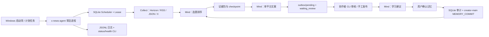

# X News Toolbox：无工作台自动 Agent 调研与改造方案

日期：2026-08-13
范围：只做架构调研和实施方案，不修改产品代码。
目标：移除工作台依赖，把产品改为可长期自动运行的后台 Agent；Minds 的排序、表达、学习、长期记忆与审计功能保持不变。

## 1. 结论先行

推荐采用 **轻量 Headless Agent Runtime**，不整体引入第二套 Agent 或工作流平台：

- 保留 `CreatorDesk`、`MindAuthority`、稳定的 `creator-main` 会话、已接受记忆召回、`usedMemoryIds`、证据版本、Horizon、X 官方 API 和 SQLite。
- 新增独立常驻进程 `x-news-agent`，负责定时触发、任务领取、心跳、租约、重试、恢复、日志和健康检查。
- Next.js 工作台退出运行主链路。比赛版可以先保留现有页面用于历史证明，最终 Headless 包不启动网页，也不自动打开浏览器。
- 配置改由环境变量、非敏感 JSON 和 CLI 完成；运行结果写入 SQLite 与 `outbox/`，用户不需要打开工作台。
- 自动化边界到“生成待审核内容”为止，继续不自动发布。审核可通过 CLI 或文件式 outbox 完成。
- 首版不增加 Redis、PostgreSQL、Temporal、LangGraph、n8n 或 Activepieces 运行时。当前是单用户、单机、每日级任务，SQLite 的事务领取足够；真正缺的是独立进程和可靠调度语义。

## 2. 当前项目的真实基础与缺口

### 已经具备，应原样保留

| 能力 | 当前实现 | 判断 |
| --- | --- | --- |
| Mind 语义主体 | `MindAuthority` 负责选题排序、平台表达、学习建议与记忆提交 | 保留，不允许调度框架替代 |
| 长期记忆因果 | `creator-main` 会话、SQLite 记忆审计、`usedMemoryIds`、平台/全局召回 | 保留 |
| 真实信息采集 | Horizon stdio MCP、RSS/JSON、X 官方 API | 保留 |
| 可恢复运行 | 雷达阶段、checkpoint、`failed_retryable`、采集结果复用 | 扩展，不推倒重写 |
| 单机防重复 | SQLite `BEGIN IMMEDIATE` 领取每日任务 | 保留并升级为租约 |
| 人工安全门 | 自动任务只准备待审核草稿，不自动发布 | 保留 |
| 便携性 | Node、Python、固定 Horizon 版本、SQLite 本地数据 | 保留 |

### 当前不是真正 Headless Agent 的原因

1. `src/instrumentation.ts` 在 Next.js 启动后才启动轮询器，Agent 的生命期依附网页服务器。
2. `follow-up-worker.ts` 使用进程内 `setInterval(60_000)`；进程退出后无人拉起，机器重启后也不会自动恢复。
3. `running` 状态没有租约过期时间。任务在领取后崩溃，可能永久停在 `running`。
4. 当前失败后把下一次运行推迟 24 小时，缺少独立的短周期重试策略、最大尝试次数和退避。
5. 便携启动器会自动打开浏览器，与“无需工作台”目标冲突。
6. 配置、启动和审核主要通过网页完成，尚无完整 CLI/文件式操作路径。
7. 运行日志主要依靠页面和 `console.error`，缺少结构化事件日志、退出码、liveness/readiness 和日志轮转边界。

## 3. GitHub 开源轮子比较

以下只采用项目官方仓库、官方源码或官方文档。

| 项目 | 功能与架构 | 技术栈 / 许可证 | 优点 | 缺点 | 本项目采用方式 |
| --- | --- | --- | --- | --- | --- |
| [Trigger.dev](https://github.com/triggerdotdev/trigger.dev) | 长时后台任务、durable cron、队列、幂等、checkpoint、自动重试、人工暂停和可观察性；托管或自托管 worker | TypeScript 为主；Apache-2.0 | 与现有 TS 最接近；后台 Agent、重试、队列和运行元数据完整 | 整体自托管远重于当前项目；托管版引入外部平台和部署依赖；会形成第二套运行账本 | 借鉴 task/run/idempotency/retry 语义；未来云端多用户版优先评估，不在单机比赛版引入 |
| [Temporal TypeScript SDK](https://github.com/temporalio/sdk-typescript) / [示例](https://github.com/temporalio/samples-typescript) | Workflow 保存确定性流程，Activity 执行外部副作用；支持 Schedule、heartbeat、retry、signal、query、worker versioning 和长时恢复 | TypeScript SDK；MIT | durable execution 最成熟；进程或机器重启后可恢复；适合数天至数月流程 | 需要 Temporal Server/Cloud、worker、task queue 和新的编程模型；对单机每日任务过度设计 | 借鉴 Activity 心跳、租约、Schedule、恢复点与版本语义；复杂多租户长流程阶段再引入 |
| [Activepieces](https://github.com/activepieces/activepieces) | 版本化 Flow、trigger/action pieces、队列 worker、重试、人工审批和大量连接器 | TypeScript monorepo；社区核心按仓库许可证，部分企业能力另有边界，采用前必须逐文件复核 | 连接器边界清楚，和当前 TypeScript 技术栈相近；运行步骤与版本化配置值得借鉴 | 完整平台包含编辑器、服务端、队列和大量包，正好重新引入用户不要的工作台 | 只借鉴小型 `SourceAdapter`、版本化配置和逐阶段执行记录，不复制平台代码 |
| [Huginn](https://github.com/huginn/huginn) | Agent 产生和消费 Event，通过有向图执行监控、筛选和动作；自托管，强调数据归用户 | Ruby on Rails、MySQL/PostgreSQL；MIT | “持续观察 → 事件 → 动作”的产品模型非常贴近新闻雷达；成熟的事件去重思路 | 技术栈不同；需要数据库与 Web 应用；图式 Agent 会和现有 CreatorDesk 重叠 | 借鉴不可变事件、来源游标、去重键和 Agent 间事件契约，不引入运行时 |
| [n8n](https://github.com/n8n-io/n8n) | 主进程负责 trigger，Redis 分发 execution，worker 从数据库读取工作流并回写结果；支持 `/healthz`、readiness 和横向扩容 | TypeScript/Vue；Sustainable Use License + Enterprise License | 生产级队列、worker 分离、健康检查和大量集成成熟 | fair-code 不是宽松 OSS；队列模式需要 Redis + PostgreSQL，官方不推荐 SQLite；强依赖可视化编辑器 | 只借鉴 scheduler/worker 分离、liveness/readiness 和多 worker 演进路径；不采用代码与运行时 |
| [LangGraph.js](https://github.com/langchain-ai/langgraphjs) | 状态图、checkpointer、thread、interrupt/resume、长期记忆与 human-in-the-loop | TypeScript；MIT | 暂停等待人工审核、数据库 checkpoint 和恢复模型清晰 | 会增加第二套 Agent 状态、记忆与线程，直接削弱 Minds 的唯一主体地位；现有流程固定，图框架收益不足 | 只借鉴 `waiting_review` 的暂停/恢复语义；不引入依赖，不让 LangGraph 管理记忆 |

### 轮子选择结论

没有一个项目适合整体搬入：

- Trigger.dev 和 Temporal 解决的是更大规模的 durable execution，当前引入成本大于收益。
- Activepieces、n8n、Huginn 都包含完整自动化平台或编辑器，会把“去掉工作台”变成“换一个工作台”。
- LangGraph.js 会与 Minds 和记忆账本重叠，破坏比赛里 Mind 的核心地位。

因此首版采用 **标准库 + 当前 SQLite + 当前领域核心** 的最短路径，同时吸收这些项目已经验证的运行语义。

## 4. 推荐目标架构



### 4.1 进程边界

新增一个唯一生产入口：

```text
x-news-agent start
```

它只做四件事：

1. 加载配置并检查 Minds、Horizon、来源和数据库可用性。
2. 周期性领取到期任务。
3. 调用现有 `CreatorDesk` 完成真实流水线。
4. 写 checkpoint、outbox、日志和健康状态。

Next.js 不再负责调度。迁移期可继续存在，但关闭 `instrumentation.ts` 的 worker，防止网页进程与 Agent 双重领取。最终 Headless 包不包含或不启动工作台。

### 4.2 Mind 保持不变的硬边界

- `MindAuthority` 接口不改语义。
- 固定使用同一个 `creator-main` 会话别名和已选择的 Mind ID。
- 创作者定位、受众、语气、内容禁区始终传给 Mind。
- 只有 `accepted` 记忆可以召回；每轮最多五条；平台记忆优先于全局记忆。
- Mind 必须返回 `usedMemoryIds`、`memoryInfluence` 和冲突；未知或未批准 ID 仍拒绝整次结果。
- 调度器只决定“何时运行/从哪恢复”，绝不决定“选什么题/怎么写/学到什么”。
- Horizon 仍只是采集和评分 worker，不成为第二个语义 Agent。

### 4.3 调度与租约

把当前单例每日任务扩展为 `agent_schedule` 和 `agent_run`：

```ts
interface AgentSchedule {
  id: string;
  enabled: boolean;
  timezone: string;
  localTime: string;
  platform: "x" | "xiaohongshu";
  sourceIds: string[];
  nextRunAt: string;
  configVersion: number;
}

interface AgentRunLease {
  runId: string;
  scheduleId: string;
  scheduledFor: string;
  ownerId: string;
  leaseUntil: string;
  heartbeatAt: string;
  attempt: number;
}
```

运行规则：

- 幂等键为 `scheduleId + scheduledFor`，同一计划时刻只允许一个运行。
- 使用 `BEGIN IMMEDIATE` 原子领取；领取后每 20–30 秒更新 heartbeat 和 `leaseUntil`。
- 若 `leaseUntil < now`，新进程可把遗留 `running` 回收为 `failed_retryable` 并从 checkpoint 恢复。
- 失败采用指数退避加抖动，例如 1、5、15、60 分钟，最多四次；配置错误不重试。
- 下次日程与本次重试分开保存，不能因为一次失败直接等到第二天。
- 每阶段继续保存输入快照、证据版本、Mind decision ID、记忆 ID 与错误类型。
- 进程收到 `SIGINT`/`SIGTERM` 时停止领取新任务，完成当前 checkpoint 后退出。

### 4.4 无工作台配置方式

建议采用“非敏感 JSON + 环境变量/本地密钥文件”：

```text
config/agent.json              # 时区、运行时间、平台、来源、阈值
data/runtime-config.json       # 本机凭证，继续不进入 Git/便携模板
data/x-news-toolbox.sqlite     # 业务和运行账本
logs/agent-YYYY-MM-DD.jsonl    # 脱敏结构化日志
outbox/pending/*.md            # 待审核内容
outbox/approved/*.md           # 已批准、待用户手工发布
```

CLI 最小命令：

```text
x-news-agent configure
x-news-agent validate
x-news-agent start
x-news-agent run-now
x-news-agent status
x-news-agent runs --last 10
x-news-agent retry <runId>
x-news-agent review <draftId> --approve|--reject|--edit <file>
```

首版不做复杂终端 UI。`configure` 逐项提示并隐藏 API Key 输入；`validate` 只显示“已配置/未配置”，绝不回显密钥。

### 4.5 无工作台的人机协作

自动 Agent 仍不能等于自动发布：

1. Agent 自动采集、排序、锁定证据、生成选定平台草稿。
2. 草稿写入 `outbox/pending/<draftId>.md`，同时保存机器可读 JSON 与校验结果。
3. 用户可直接编辑 Markdown，再用 CLI 批准；批准后移到 `outbox/approved/` 并写 SQLite 审计。
4. 用户在平台手工发布，再用 `record-publication` 命令登记 URL、最终文本和指标。
5. Mind 产生学习建议；用户通过 CLI 接受/编辑/替代/删除，随后进入 `MEMORY_COMMIT` 闭环。

以后若需要通知，可增加一个 `NotificationAdapter`，先支持桌面通知或邮件；它只发送状态，不拥有业务决策。

### 4.6 健康检查与日志

无工作台不代表不可观察：

- `status` 从 SQLite 读取：进程启动时间、最近心跳、当前阶段、下次运行、最近成功、最近错误。
- 可选的 localhost-only `GET /healthz` 只返回 liveness；`GET /readyz` 检查数据库、配置、Minds/Horizon 可用性，不提供工作台页面。
- JSONL 日志字段固定为 `timestamp`、`level`、`event`、`runId`、`stage`、`attempt`、`durationMs`、`errorType`。
- 日志脱敏沿用现有规则，禁止写 API Key、Authorization、完整本机路径和原始 X 帖文长期副本。
- 每日新文件而不是无限增长单文件；保留策略作为配置，删除仍必须遵守项目的单文件安全规则。

### 4.7 Windows 便携和自动启动

首版提供两种运行方式：

- **便携手动启动**：`start-agent.cmd`，不打开浏览器，窗口显示当前状态和日志路径。
- **自动启动**：`install-startup.ps1` 创建 Windows 任务计划，在用户登录或机器启动时运行，并设置失败后重启。安装属于系统状态变更，实施时必须由用户明确执行/确认。

不新增 WinSW/NSSM 等二进制轮子；Windows 任务计划已经足够。便携构建继续排除 `.env`、runtime config、SQLite、日志和真实 outbox。

## 5. 分阶段实施方案

### 阶段 A：建立独立 Agent Runtime（最优先）

1. 抽出 `AgentRunner`，复用 `createAppDesk()` 与现有 scheduler store。
2. 新增独立入口和 `start/run-now/status/validate` 四个最小命令。
3. Next.js `instrumentation.ts` 不再启动 worker。
4. 便携启动器改为启动 Agent，不打开浏览器。
5. 配置缺失时 fail closed，输出具体缺少项，不进入 demo fallback；生产自动运行不得生成 synthetic 内容。

验收：关闭所有浏览器和 Next.js 后，Agent 仍能按时间运行，并产生真实 `waiting_review` 草稿。

### 阶段 B：补齐 durable 语义

1. 增加 lease、owner、heartbeat、attempt、nextRetryAt 和 configVersion。
2. 实现崩溃后过期租约回收。
3. 采集、Mind 排序、草稿阶段分别恢复；Mind 超时不重复采集。
4. 加指数退避、配置错误终止、最大尝试次数。
5. 加 graceful shutdown 与单实例锁。

验收：在 collecting/ranking/drafting 三个阶段强制终止进程，重启后均从正确 checkpoint 恢复且不重复发布草稿。

### 阶段 C：移除工作台依赖

1. 增加 `configure/review/record-publication/memory` CLI。
2. 建立 `outbox/pending` 和 `outbox/approved` 文件契约。
3. 页面路由不再进入 Headless 构建；API 只保留可选 health/readiness。
4. 保留比赛 `/proof` 数据结构的离线导出命令，例如 `x-news-agent proof --output proof.json`，不要求网页。

验收：新电脑只通过命令行即可配置、自动运行、审核、登记发布、确认记忆和导出比赛证明。

### 阶段 D：自动启动、通知和规模化准备

1. Windows 任务计划安装/卸载脚本；失败自动重启。
2. 可选 `NotificationAdapter`。
3. 增加数据库备份和 schema migration 前置检查。
4. 当出现多用户、多机器或高并发需求时，再把 store 接口迁移到 PostgreSQL，并评估 Trigger.dev Cloud；只有需要跨数日复杂信号/补偿流程时才采用 Temporal。

## 6. 预计文件边界（确认后才动手）

建议新增：

```text
src/agent/main.ts
src/agent/agent-runner.ts
src/agent/commands.ts
src/agent/config.ts
src/agent/logger.ts
src/agent/outbox.ts
src/agent/health.ts
scripts/build-agent.ps1
portable/start-agent.cmd
portable/install-startup.ps1
config/agent.example.json
```

建议修改：

```text
src/instrumentation.ts                 # 停止在 Next 进程启动调度
src/server/follow-up-worker.ts         # 变为可复用 runner，不再拥有 setInterval
src/adapters/sqlite-health.ts          # lease/retry/schedule/run 表
src/server/workspace-data.ts           # durable run 字段
scripts/build-portable.ps1             # 打包 agent 入口，不带真实配置/数据
package.json                           # agent 脚本与独立构建
README.md / docs/architecture.md       # Headless 使用方式
```

现有 `src/app/**` 不应立即批量删除。先让 Headless 运行通过并与现有数据兼容，再逐文件决定保留为比赛证明工具、归档或停止打包，符合项目禁止批量删除的安全规则。

## 7. 测试与验收

### 自动测试

- Next.js 未启动时，计划仍可触发。
- 同一 `scheduleId + scheduledFor` 不会重复运行。
- 两个 Agent 进程同时竞争时只有一个获得 lease。
- 进程崩溃后，过期 lease 能被回收并从正确 checkpoint 恢复。
- 配置错误不重试；网络/超时按退避重试且不超过上限。
- 采集完成后 Mind 超时，重试不得再次访问来源。
- 自动运行只生成 `waiting_review`，不存在发布调用。
- 只有接受记忆进入下一轮；未知 `usedMemoryIds` 继续拒绝。
- 平台每次只生成配置指定的 X 或小红书版本。
- 日志、outbox、proof 导出不含 API Key、Authorization 和本机隐私路径。
- 老 SQLite 数据可迁移，现有 Radar、Proposal、Publication、Learning、Memory 不丢失。
- 测试、TypeScript 检查、Agent 构建、便携构建全部通过。

### 真实现场验收

1. 关闭浏览器和网页服务器。
2. 运行 `x-news-agent validate`，确认 Mind、Horizon、来源和数据库就绪。
3. 启动 Agent，并等待计划触发或执行 `run-now`。
4. `status` 能看到 collecting → ranking → drafting → waiting_review。
5. `outbox/pending` 出现带来源、证据版本、Mind decision ID、`usedMemoryIds` 的真实草稿。
6. 强制关闭 Agent 后重启，能恢复而不重复采集。
7. 审核、登记真实发布、确认学习记忆，再运行第二轮，证明记忆影响仍成立。
8. 重启电脑后，Windows 任务计划能自动拉起 Agent。

## 8. 不在本轮范围

- 自动发帖、自动回复、点赞或关注。
- 多用户云账号、OAuth、团队权限和计费。
- Redis、PostgreSQL 和多 worker 横向扩展。
- 新的向量数据库或第二套长期记忆服务。
- 用 LangGraph、Temporal 或其他框架替换 Minds。
- 删除现有历史数据或批量删除工作台文件。

## 9. 最终建议

选择 **方案 A：本地常驻 Headless Agent + SQLite lease/checkpoint + CLI/outbox**。

它最符合当前产品阶段：改动集中、可离线便携、保留全部 Mind 价值，同时真正做到“不打开工作台也能自己工作”。更重的平台只保留为规模化路线，而不是现在的依赖。

确认后建议按 **A → B → C → D** 开工，先证明浏览器完全关闭时 Agent 仍能真实跑通，再处理工作台停止打包与自动启动。

## 10. 一手来源

- Trigger.dev 官方仓库：[triggerdotdev/trigger.dev](https://github.com/triggerdotdev/trigger.dev)
- Trigger.dev 官方文档：[Tasks overview](https://trigger.dev/docs/tasks/overview)、[Scheduled tasks](https://trigger.dev/docs/tasks/scheduled)、[Idempotency](https://trigger.dev/docs/idempotency)
- Temporal TypeScript SDK：[temporalio/sdk-typescript](https://github.com/temporalio/sdk-typescript)
- Temporal TypeScript 官方示例：[temporalio/samples-typescript](https://github.com/temporalio/samples-typescript)，包含 schedules、activity heartbeat、worker versioning、signals/queries 和 continue-as-new 示例
- Activepieces 官方仓库：[activepieces/activepieces](https://github.com/activepieces/activepieces)
- Huginn 官方仓库：[huginn/huginn](https://github.com/huginn/huginn)
- n8n 官方仓库：[n8n-io/n8n](https://github.com/n8n-io/n8n)
- n8n 官方 queue mode 文档：[Enable queue mode](https://docs.n8n.io/hosting/scaling/queue-mode/)
- LangGraph.js 官方仓库：[langchain-ai/langgraphjs](https://github.com/langchain-ai/langgraphjs)
- LangGraph.js 官方 human-in-the-loop 文档：[Interrupt and resume](https://docs.langchain.com/oss/javascript/langgraph/interrupts)
