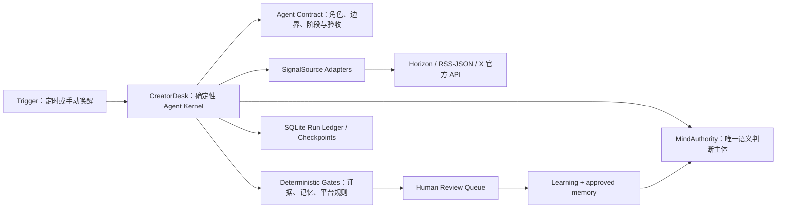

# 通用 AI Agent 框架在 X News Toolbox 中的复用与落地方案

> 状态：方案草案，等待用户确认后再实施。本文不授权修改业务代码。

## 1. 结论

`通用AI_Agent可复用框架模板.md` 对本项目有复用价值，但它是**治理模板与提示词模板**，不是可以直接安装的 Agent 运行时。

建议采用“治理层复用、运行层不替换”的方式：

- 保留 `Minds + CreatorDesk + SQLite + Horizon + 官方 X API`。
- Mind 继续是唯一语义判断主体。
- 把模板的岗位卡、输入要求、验收门、异常升级、交接单和指标，整理成版本化的 `Agent Contract`。
- 将 Markdown 规则对应到 TypeScript 类型、Zod schema、SQLite checkpoint 和自动测试，避免规则只存在于文档里。
- 不引入第二套 Agent runtime、记忆服务、数据库、身份体系或可视化工作流编辑器。

整体复用判断：

| 范围 | 复用程度 | 判断 |
| --- | --- | --- |
| 角色、使命、边界 | 高 | 可直接改写为 X News Toolbox 岗位卡与 Mind Skill |
| 输入、输出与验收门 | 高 | 可映射到现有 Zod schema、证据校验和平台校验 |
| 异常升级与人工审批 | 高 | 可映射到现有 run stage、重试和 `waiting_review` |
| 标准交接单 | 中高 | 应改成 typed checkpoint，而不是 Agent 间自然语言转述 |
| 总控调度模板 | 中 | 由现有 `CreatorDesk` 承担，不再新增一个 LLM 总控 |
| 多 Agent 岗位库 | 低 | 本项目没有必要拆成多个自主 Agent；改为同一 Mind 的阶段化能力 |
| 三案例测试与成功指标 | 高 | 可转成 Vitest 契约测试、真实运行验收和比赛证明 |

## 2. 当前项目已经具备的能力

当前项目不是空白框架，已有以下深模块与真实 seam：

- `CreatorDesk.submit/inspect`：唯一业务入口，集中处理流程、幂等、版本冲突和安全门。
- `MindAuthority`：隔离 Minds SDK，负责自主计划、排序、提案、平台表达、学习和记忆提交。
- `SignalSource`：Horizon、JSON/RSS 与 X 官方 API 的统一来源接口。
- SQLite stores：保存创作者档案、信号、证据、草稿、审核、发布关联、记忆与运行记录。
- Run ledger：已具备 `queued`、`collecting`、`ranking`、`researching`、`drafting`、`waiting_review`、失败与完成阶段，以及 checkpoint/replay。
- Zod 输出契约：Mind 的计划、排序、草稿和学习输出已经进行结构校验。
- 人工控制：Agent 只准备待审核内容，不存在自动发布命令。

因此，本轮框架化工作的重点是**整合和显式化**，而不是重写。

## 3. 模板到项目的精确映射

| 通用模板 | 本项目落点 | 处理方式 |
| --- | --- | --- |
| 最小岗位卡 | `docs/mind-skill.md` | 补齐输入、交付物、验收和成功指标，形成可审计版本 |
| 完整系统提示词 | `MindsMindAuthority` 的阶段提示 | 拆成 plan/rank/draft/learn 四类短契约，避免单个巨型提示词 |
| 总控调度 Agent | `CreatorDesk` + scheduler | 作为确定性主控；不增加第二个 LLM 总控 |
| 多 Agent 工作流 | 同一 Mind 的阶段化调用 | “岗位”改为能力阶段，不创建多个身份与记忆 |
| 单一事实来源 | SQLite + EvidencePacket | 继续作为事实与审计源，不让聊天历史替代数据库 |
| 标准交接单 | `RunCheckpoint`/`RadarJobRecord` | 结构化保存输入快照、证据版本、决策 ID、记忆 ID 和 gate 结果 |
| 验收门 | Zod + evidence validator + platform validator | 机器拒绝不合格结果，不依赖模型自称“已质检” |
| 异常与升级 | retryable/terminal + human review | 按错误类型决定重试、暂停或人工处理 |
| 三案例测试 | contract tests + integration tests | 正常、缺失/冲突、高风险三组固定测试 |
| 成功指标 | creator validation + competition proof | 区分产品指标、运行指标和比赛证据 |

## 4. 推荐目标架构



这个设计保持三个清晰边界：

1. **Mind 决策，代码守边界。** 选什么、为何选、怎么写由 Mind 决定；权限、数量、证据、格式和发布边界由确定性代码执行。
2. **数据库保存事实，Mind 保存语义连续性。** SQLite 是审计源；稳定 Mind 会话承载创作者持续身份，但不能覆盖或伪造数据库状态。
3. **Adapter 只隔离真正可能替换的外部能力。** 当前 `MindAuthority` 和 `SignalSource` 都已有两个以上实现，是有效 seam；不要为每一个内部函数增加接口。

## 5. Agent Contract 的最小内容

框架不需要一个新的运行库。建议新增一个版本化契约，并让文档、schema 和测试共同引用同一语义：

```ts
interface CreatorAgentContract {
  version: string;
  role: "creator-content-intelligence-agent";
  mission: string;
  priorities: string[];
  requiredInputs: string[];
  capabilities: string[];
  prohibitedActions: string[];
  stages: RunStage[];
  gates: AgentGateDefinition[];
  escalation: FailurePolicy[];
  metrics: MetricDefinition[];
}
```

不建议把整个提示词写进 TypeScript。契约只保存稳定业务规则；具体提示仍由 `MindAuthority` adapter 负责。

## 6. 分阶段实施方案

### 阶段 A：统一契约，不改运行模型

- 建立一份 X News Toolbox 最小岗位卡，明确目标用户、输入、输出、不可执行动作和成功指标。
- 为现有 plan/rank/draft/learn 输出建立统一 contract version。
- 在 run record 中记录 `contractVersion`，使历史结果可解释。
- 将 `docs/mind-skill.md`、OpenAPI 和实现中的边界措辞对齐。

验收：同一条规则在岗位卡、Tool API、Zod 和测试中不互相矛盾。

### 阶段 B：把交接单变成结构化 checkpoint

- 在 checkpoint 明确保存 input snapshot、facts、assumptions、unknowns、evidence version、Mind decision ID、used memory IDs、gate result 和 next stage。
- 不保存冗长的 Agent 间自然语言交接；下游阶段只读取 typed envelope。
- 明确 live/replay/demo，禁止 replay 或 demo 被标记为本轮真实执行。

验收：进程在 collecting、ranking、drafting 任一阶段中断后，能从正确位置恢复且不重复采集。

### 阶段 C：统一质量门与异常策略

- 建立输入门、证据门、记忆门、平台门和人工审批门。
- 错误分为 configuration、transient、invalid_mind_output、policy_violation、human_required。
- 只对 transient 和允许修订的 invalid output 自动重试；高风险动作不自动重试。
- 保留现有“平台草稿最多重写两次”，不要机械套用模板中的统一三次。

验收：错误类型决定唯一且可测试的恢复行为。

### 阶段 D：三案例与真实效果评测

- 正常案例：真实来源 → Mind 选题 → 单平台草稿 → 人工审核。
- 缺失/冲突案例：来源缺字段或相互冲突时，输出 unknown/conflicted，不补造事实。
- 越界案例：要求自动发布、读取密钥或扩大来源范围时拒绝并转人工。
- 继续记录耗时、采用率、修改原因、失败阶段和记忆对第二轮的影响。

验收：自动测试通过，并至少完成两轮真实创作者闭环。

## 7. 明确不做

- 不把模板复制成一个超长系统提示词。
- 不新增“研究 Agent、写作 Agent、质检 Agent”等多个独立 Mind。
- 不新增向量数据库、第二记忆服务或第二任务数据库。
- 不用聊天文本作为阶段交接或唯一事实来源。
- 不因为框架化而替换 Horizon、官方 X API 或现有 SQLite。
- 不增加自动发布能力。

## 8. 决策门

用户确认后，建议按 A → B → C → D 顺序实施。第一阶段只整理和统一现有规则，风险最低；每个阶段均应通过测试、类型检查与生产构建后再进入下一阶段。
