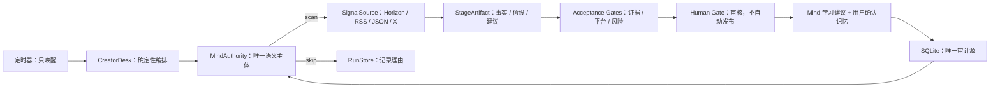

# 通用 AI Agent 模板与 X News Toolbox：开源轮子对比及复用方案

日期：2026-08-15
范围：只做模板适配、GitHub 一手资料调研与实施方案；不修改产品代码，不安装新运行时。

## 1. 结论先行

用户提供的《通用 AI Agent 可复用框架模板》对 X News Toolbox **有较高复用价值，但它是治理与提示词模板，不是可安装的 Agent 运行时**。

最适合的用法是：

- 将“岗位卡、任务边界、输入检查、固定输出、验收门、交接单、异常升级、测试案例、运行指标”固化为项目的 **Agent Governance Pack**。
- 继续让 `MindAuthority` 作为唯一语义决策主体；`CreatorDesk` 作为唯一业务入口；Horizon、JSON、RSS、X 继续作为工具和数据源。
- 把模板里的“多 Agent 岗位”默认实现成 **确定性阶段和接口**，而不是再启动多个 LLM Agent。
- SQLite 继续作为运行、证据、审核和记忆的单一审计源；不引入第二套 checkpoint、数据库或身份体系。
- 首版不直接依赖本文比较的七个框架；只吸收它们已验证的设计模式。未来达到多租户、多机器、长时强 SLA 后，再单独评估 Temporal。

一句话建议：

> 先把通用模板“压进”现有 Mind-first 闭环，形成可验证的角色契约、阶段交接和验收门；不要为了显得通用而搭建第二套 Agent 平台。

## 2. 模板与当前项目的匹配判断

### 2.1 可直接复用的治理层

| 模板部分 | 当前项目对应位置 | 复用方式 | 复用度 |
| --- | --- | --- | --- |
| 最小岗位卡 | `MindAuthority`、`SignalSource`、平台校验、人工审核 | 为每个边界写职责、允许输入、禁止输入、固定输出、人工边界 | 高 |
| 单 Agent 系统提示词 | `docs/mind-skill.md` 与稳定 `creator-main` 会话 | 统一身份、使命、输入检查、事实规则、输出 Schema 和验收条件 | 高 |
| 总控调度 Agent | `CreatorDesk.submit/inspect` 与 `planAutonomousRun` | 由 Mind 决定 `scan/skip` 和任务强度，调度器只唤醒与执行 | 高 |
| 多 Agent 工作流 | SQLite RunStage/checkpoint | 改写成阶段状态机；除 Mind 外，其余岗位优先为确定性工具 | 中高 |
| 标准交接单 | 雷达信号、证据包、平台草稿、学习记录 | 统一为版本化 `StageArtifact`，显式区分事实、假设、建议 | 高 |
| 三类案例测试 | Vitest、集成测试、比赛旅程测试 | 固化正常、资料缺失、高风险三组契约测试 | 高 |
| 公式和成功指标 | proof、creator tests、运行账本 | 增加采用率、修订率、来源覆盖、恢复成功率等指标 | 高 |
| 落地原则 | 架构文档、CI、人工审核门 | 变成可执行约束，而不是停留在提示词 | 高 |

### 2.2 不应照搬的部分

- 不把“总控调度 Agent”实现为第二个 LLM。当前 `MindAuthority.planAutonomousRun()` 已承担语义规划，`CreatorDesk` 负责确定性编排。
- 不把采集、校验、存储包装成会自由思考的 Agent。Horizon 是采集工具，平台适配器是规则校验器，SQLite Store 是审计设施。
- 不用通用框架重新表达现有固定闭环。项目已经有 Radar、Proposal、Evidence、Review、Publication、Learning、Memory 和 Run checkpoint。
- 不允许框架自带 memory/store 取代 Minds 会话与 SQLite 记忆审计，否则会失去“哪条记忆如何影响下一轮”的比赛证据。

## 3. 当前兼容性基线

X News Toolbox 当前基线：

- Node.js 22、TypeScript 5.9、Next.js 16、React 19、pnpm。
- `@animocabrands/minds-client-lib` 提供 Minds 接入，`MindAuthority` 隔离所有语义判断。
- Horizon 通过固定版本的 Python stdio MCP Worker 提供采集、评分、去重与背景补充。
- SQLite 保存创作者配置、运行 checkpoint、证据版本、审核、发布、学习和长期记忆。
- Zod 已用于输入和输出校验，Vitest 已用于契约与旅程测试。
- 当前目标是单用户、便携、低频定时运行；自动运行止于 `waiting_review`，不自动发布。

因此候选轮子必须先回答三个问题：

1. 是否增强现有 Mind-first 闭环，而不是取代 Mind？
2. 是否能复用当前 TypeScript/SQLite/Next.js 边界，而不是建立第二套控制面？
3. 引入的运行、部署、许可证和运维成本，是否小于它解决的问题？

## 4. 七个官方开源/源码可见轮子比较

活跃度为 2026-08-15 抓取 GitHub 官方页面的快照；star 数是 GitHub 的近似显示，不应当作长期不变事实。

| 项目 | 核心功能与架构 | 技术栈 / 许可证 | 活跃度快照 | 与项目贴合度 | 建议 |
| --- | --- | --- | --- | --- | --- |
| [OpenAI Agents SDK JS](https://github.com/openai/openai-agents-js) | Agent loop、tools/MCP、handoff、guardrails、session、HITL、tracing；轻量 Runner 驱动 | TypeScript 98%，Node 22+；MIT | 约 3.2k stars，56 个 releases；`v0.11.6` 于 2026-05-29 发布 | 技术栈高；产品边界中低 | 借鉴 tool schema、guardrail、暂停恢复和 trace；不引入第二个 Agent runtime |
| [Microsoft AutoGen](https://github.com/microsoft/autogen) | Core 消息/事件运行时、AgentChat 高层多 Agent、Extensions、Studio；Python/.NET 分层 | Python、.NET、Protobuf；MIT | 3,782 commits；官方 README 已标注 maintenance mode | 低 | 只借鉴分层消息契约；新项目不采用，官方建议转向其后继框架 |
| [LangGraph.js](https://github.com/langchain-ai/langgraphjs) | typed state graph、节点/边、checkpoint、interrupt/resume、store、HITL | TypeScript；MIT | 约 3.2k stars、3,077 commits；`1.4.10` 于 2026-08-14 发布 | 概念中高；整体引入中低 | 借鉴显式状态图与 interrupt；不重复 CreatorDesk/SQLite checkpoint |
| [CrewAI](https://github.com/crewAIInc/crewAI) | Crews 负责角色协作；Flows 负责事件驱动、状态和条件分支 | Python 98.7%，Python 3.10–3.13；MIT | 约 53.6k stars、201 个 releases；`1.14.7` 于 2026-06-11 发布 | 低 | 借鉴 Crew/Flow 的“自治与确定性分层”；不增加 Python 多 Agent sidecar |
| [Activepieces](https://github.com/activepieces/activepieces) | App/API、Worker、Sandbox、Engine、React Flow UI；typed trigger/action pieces，Redis 队列与 step resume | TypeScript monorepo、React/Vite、Fastify、BullMQ、PostgreSQL；MIT + 企业目录商业许可 | 约 23.8k stars、60,483 commits；`0.88.1` 于 2026-08-14 发布 | 技术语言中高；嵌入低 | 借鉴 Piece 接口、版本化步骤和连接隔离；不整体嵌入 |
| [n8n](https://github.com/n8n-io/n8n) | 可视化工作流、trigger、main/worker、Redis queue、数据库执行账本、大量连接器 | TypeScript/Vue；Sustainable Use License + Enterprise License | 约 197k stars、720 个 releases；`2.30.5` 于 2026-07-15 发布 | 中低 | 借鉴 scheduler/worker、health、connector；不复制代码、不作为产品核心 |
| [Temporal](https://github.com/temporalio/temporal) / [TS SDK](https://github.com/temporalio/sdk-typescript) | Durable Workflow 保存事件历史并 replay；Activity 执行副作用；task queue、retry、heartbeat、signal/query | Server 为 Go；SDK 为 TypeScript/Rust/Node，支持 Node 20/22/24；MIT | Server 约 22.3k stars；`v1.31.2` 于 2026-07-08，TS SDK `v1.22.0` 于 2026-08-05 发布 | 当前低；规模化后中高 | 借鉴 Workflow/Activity、幂等、重试分类和 heartbeat；暂不部署 Server/Worker |

## 5. 逐项优缺点与可复用边界

### 5.1 OpenAI Agents SDK JS

官方仓库将核心能力定义为 Agents、tools/MCP、agents-as-tools/handoffs、guardrails、sessions、human-in-the-loop 和 tracing，并使用 TypeScript 与 Zod。项目可直接运行于 Node 22，与现有技术栈兼容。[官方 README](https://github.com/openai/openai-agents-js)

**优点**

- TypeScript、Node 22 和 Zod 与当前仓库高度兼容。
- 工具输入 Schema、审批暂停、运行状态序列化和 tracing 的接口设计成熟。
- 运行时原语少，理解成本低于完整工作流平台。

**缺点**

- 它仍然是一套新的 Agent loop、session 和 tracing 体系。
- 如果让它负责选题、路由或记忆，会与 Minds 的身份、长期记忆和语义权威竞争。
- 需要额外模型提供者配置；当前比赛需要突出 Mind，而不是新增一个主 Agent。

**采用边界**

- 借鉴 function tool + Zod 的声明方式、guardrail、HITL interrupt 和 trace/span 字段。
- 不新增 `@openai/agents` 运行时，不把 Mind 包装成某个从属 Agent。

### 5.2 Microsoft AutoGen

AutoGen 官方 README 将其描述为 Core、AgentChat 和 Extensions 三层，并提供 Studio/Bench；同一 README 已明确标注 **maintenance mode**，新用户应使用 Microsoft Agent Framework。[官方仓库](https://github.com/microsoft/autogen)

**优点**

- 事件驱动、消息传递、分布式 runtime 和跨语言层次清楚。
- AgentChat 能快速表达多 Agent 讨论、委派和群聊。

**缺点**

- Python/.NET 与当前 Next.js 主运行时不一致。
- 多 Agent 会让当前一条清晰的 Mind 因果链变成难审计的 Agent 对话网络。
- 项目已进入维护模式，不适合成为新架构基础。

**采用边界**

- 只借鉴 Core/AgentChat/Extensions 的分层思想：运行协议、语义主体、工具扩展分开。
- 不直接引入依赖或 Studio。

### 5.3 LangGraph.js

LangGraph 官方将其定位为低层级、有状态的 Agent 编排框架，支持 durable execution、streaming、human-in-the-loop、checkpoint 和跨线程 store；它不替用户抽象 prompt 或 Agent 架构。[官方概览](https://docs.langchain.com/oss/javascript/langgraph/overview)

**优点**

- TS 版本可直接进入 Node 项目。
- `StateGraph` 适合表现 collecting → ranking → drafting → waiting_review → learning。
- interrupt/resume 和 checkpoint 的概念适合人工审核和故障恢复。

**缺点**

- 当前 `CreatorDesk` 已经是固定状态机，SQLite 也已有 checkpoint。
- 再增加 checkpointer/store 会产生第二套状态真相。
- 动态图的收益不足以覆盖迁移、测试和持久化成本。

**采用边界**

- 借鉴 typed state、节点最小输入输出、确定性节点和 Mind 节点分层、interrupt 语义。
- 除非未来出现大量动态分支、子图和并行 Agent，否则不引入依赖。

### 5.4 CrewAI

CrewAI 官方把 **Crews** 定义为角色化自治协作，把 **Flows** 定义为事件驱动、状态化、可条件路由的确定性编排；框架独立于 LangChain。[官方仓库](https://github.com/crewAIInc/crewAI) / [官方概览](https://docs.crewai.com/core-concepts/Agents)

**优点**

- “自治只放在必要位置，其他步骤保持可控”的思想与模板一致。
- Role、Goal、Task、Expected Output 对岗位卡很有启发。
- Flow 支持状态、条件分支和持久化语义。

**缺点**

- Python sidecar 会增加第二套依赖、进程、日志和部署。
- 角色扮演式多 Agent 并不适合当前单一 Mind 权威。
- Crew memory 和项目现有 Minds/SQLite 记忆会重叠。

**采用边界**

- 借鉴 Crew/Flow 分离，以及 Agent/Task 的固定输出契约。
- 不运行 CrewAI，不创建研究员/编辑/审校多个 LLM Agent。

### 5.5 Activepieces

Activepieces 是完整的 Zapier 类自动化产品，而不是嵌入式库。生产架构包含 App、Worker、Engine、Sandbox、PostgreSQL 和 Redis；pieces 是类型安全的 trigger/action 包。[官方架构](https://www.activepieces.com/docs/install/architecture/overview) / [官方技术栈](https://www.activepieces.com/docs/handbook/engineering/onboarding/stack)

**优点**

- Piece 的 trigger/action、版本和连接凭据边界清楚。
- step run log、resume/skip、sandbox 与人工审批成熟。
- 与 TypeScript 技术语言接近。

**缺点**

- 会引入另一套 UI、账号、权限、数据库、队列和运行账本。
- 正式部署需要 PostgreSQL、Redis 和 Worker，不适合当前便携 SQLite 产品。
- 仓库是混合许可，企业目录不能按普通 MIT 使用。[官方 LICENSE](https://github.com/activepieces/activepieces/blob/main/LICENSE)

**采用边界**

- 借鉴 `Piece` 的小型 Adapter、版本化配置、连接密钥与流程定义分离。
- 不嵌入整个平台，不复制企业目录代码。

### 5.6 n8n

n8n 是源码可见的可视化自动化平台。其 queue mode 由 main 接收 trigger，把 execution ID 放入 Redis，worker 从数据库读取流程并回写结果；官方明确不推荐 SQLite queue mode。[官方 queue mode](https://github.com/n8n-io/n8n-docs/blob/main/docs/deploy/host-n8n/configure-n8n/scaling/enable-queue-mode.md)

**优点**

- trigger/worker 分离、健康检查、连接器、重试和执行历史成熟。
- TypeScript 与现有主技术栈接近。
- 适合作为外部自动化集成层或运维参考。

**缺点**

- 是另一套工作台，和用户希望减少工作台依赖的方向冲突。
- queue mode 需要 Redis + PostgreSQL；会破坏当前便携部署。
- n8n 使用 Sustainable Use License 和 Enterprise License，官方明确称其为 fair-code 而非 OSI 开源；商业产品嵌入存在边界。[官方许可证说明](https://github.com/n8n-io/n8n-docs/blob/main/docs/privacy-and-security/sustainable-use-license.md)

**采用边界**

- 只借鉴 scheduler/worker 分离、`/healthz`/readiness、Connector/credential 隔离。
- 不复制源码，不将 n8n 作为项目内嵌运行时。

### 5.7 Temporal

Temporal 通过 append-only event history 和 replay 提供 durable execution；Workflow 必须保持确定性，外部副作用放进可重试的 Activity，Worker 从 task queue 领取任务。[官方架构](https://github.com/temporalio/temporal/blob/main/docs/architecture/README.md) / [TypeScript SDK](https://github.com/temporalio/sdk-typescript)

**优点**

- 进程或机器重启后的恢复、durable timer、retry、heartbeat、signal/query 和版本演进成熟。
- TypeScript SDK 支持 Node 22。
- 最适合未来跨小时/天、多租户、高 SLA 的自动 Agent。

**缺点**

- 需要 Temporal Server/Cloud、独立 Worker、task queue、事件历史存储和额外运维。
- 会形成 Temporal History 与业务 SQLite 两套持久化事实。
- Workflow 确定性和 Activity 拆分带来新的编程约束。

**采用边界**

- 现在借鉴 Workflow/Activity、副作用隔离、幂等、错误分类、heartbeat 和 replay 纪律。
- 只有进入多机器、多租户、长时流程和强 SLA 后才考虑真实依赖。

## 6. 选择结论

### 6.1 当前版本：不引入新框架运行时

七个候选中，没有一个满足“新增价值明显、又不重复现有运行账本/记忆/身份体系”的条件。

| 选择 | 结论 | 原因 |
| --- | --- | --- |
| 直接采用 OpenAI Agents SDK | 否 | 第二套 Agent loop/session，削弱 Minds 主体地位 |
| 直接采用 AutoGen | 否 | 维护模式、跨语言、多 Agent 过度设计 |
| 直接采用 LangGraph.js | 否 | 重复 CreatorDesk 状态机和 SQLite checkpoint |
| 直接采用 CrewAI | 否 | Python sidecar、多 Agent 与记忆重叠 |
| 直接采用 Activepieces | 否 | 完整平台、Postgres/Redis、混合许可证 |
| 直接采用 n8n | 否 | 工作台和基础设施过重，fair-code 商业边界 |
| 直接采用 Temporal | 当前否、未来候选 | 当前问题规模小；规模化后价值明确 |

### 6.2 应直接复用的“轮子模式”

- OpenAI Agents SDK：工具 Schema、guardrail、approval interruption、trace/span 字段。
- AutoGen：Core/AgentChat/Extensions 的分层语言。
- LangGraph：显式状态、interrupt/resume、最小节点输入输出。
- CrewAI：自治 Crew 与确定性 Flow 分离；Agent/Task 固定输出。
- Activepieces：typed piece、版本化步骤、凭据隔离、step run log。
- n8n：trigger/main/worker 分离、health/readiness、连接器演进。
- Temporal：Workflow/Activity、幂等、heartbeat、错误分类、event history/replay。

## 7. 推荐搭建方案：Agent Governance Pack

### 7.1 核心原则



### 7.2 将模板落成五个可复用契约

#### A. `AgentRoleCard`

描述唯一语义 Agent 的职责，不增加多个运行时 Agent：

- 身份、使命、适用场景。
- 允许输入、禁止输入。
- 可调用工具与禁止动作。
- 固定输出 Schema。
- 验收门、人工边界、升级条件。
- 版本号和变更原因。

#### B. `RunEnvelope`

所有阶段共享最小上下文，防止提示词和数据库字段各说各话：

```ts
interface RunEnvelope {
  schemaVersion: string;
  runId: string;
  mode: "micro" | "sprint" | "full";
  goal: string;
  facts: Array<{ text: string; evidenceRef: string }>;
  assumptions: string[];
  recommendations: string[];
  usedMemoryIds: string[];
  riskLevel: "low" | "medium" | "high";
  approvalRequired: boolean;
  retryCount: number;
  nextAction: string;
}
```

模式建议：

- `micro`：复用已有信号完成一次快速判断或单条草稿。
- `sprint`：标准扫描、排序、证据、单平台草稿、人工审核。
- `full`：多来源研究、冲突检查、风险升级和更完整证据包。

运行模式由 Mind 提议，但由确定性策略限制可用工具、预算、输出数和风险门。

#### C. `StageArtifact`

替代自由文本“Agent 交接”：

- 输入快照与配置版本。
- 已确认事实及 `evidenceRefs`。
- 未确认假设与未知项。
- Mind 建议及 decision ID。
- `usedMemoryIds` 与具体影响。
- 校验结果、风险和下游动作。

每个 Artifact 写入当前 SQLite Run Ledger；不新建另一数据库。

#### D. `AcceptanceGate`

将模板验收门变成确定性校验：

- `InputGate`：必填配置、来源权限和密钥状态。
- `EvidenceGate`：主张是否有来源，事实/假设是否分开。
- `MemoryGate`：仅允许已接受记忆；未知 ID 拒绝整次结果。
- `PlatformGate`：X 完整成句且不超过限制；小红书内容包字段齐全。
- `RiskGate`：高风险、冲突或不可确认内容必须进入人工审核。
- `PublicationGate`：只允许批准，不存在自动发布动作。

#### E. `RunPolicy`

- 业务内容自动修订仍保持最多两次，失败后保留原稿并进入人工编辑。
- 短暂网络/超时最多三次基础设施尝试，采用退避；配置错误立即终止。
- 不可逆动作、高风险内容和持续失败统一升级人工。
- 每一步只读取最少输入并产生版本化输出。

## 8. 分阶段实施方案

### 阶段 0：规格冻结，不动运行时

1. 把模板整理成项目级 Role Card、Run Policy 和标准交接单。
2. 明确只有 `MindAuthority` 是语义 Agent，其余全是工具、Store、Gate 或 Scheduler。
3. 记录当前 SQLite schema、API、Skill 和比赛证明的数据兼容基线。

验收：任何岗位都能回答“职责、输入、输出、禁止动作、验收、人工边界”，且不存在第二个语义主体。

### 阶段 1：结构化 I/O 与验收门

1. 在现有 Zod 基础上定义 `RunEnvelope`、`StageArtifact` 和 `AcceptanceGateResult`。
2. 让现有 Mind Skill 输出继续保留 `usedMemoryIds`、`memoryInfluence`、未知项和 evidence refs。
3. 在 `CreatorDesk` 边界执行校验，不让页面、Worker 或 prompt 各自复制业务规则。

验收：正常、资料缺失、高风险三类案例都有固定输出和明确失败原因。

### 阶段 2：模式、重试与人工升级

1. 将 Micro/Sprint/Full 映射到当前固定闭环的预算和工具白名单，不创建不同 Agent 团队。
2. 区分内容修订、网络重试、配置错误和终止错误。
3. 把“最多三次重试”“人工升级”写入 SQLite run ledger 和状态输出。

验收：失败恢复不重复采集；达到重试上限后不静默继续；高风险必须等待审核。

### 阶段 3：可观察性与真实指标

1. 统一运行事件：`run.started`、`stage.completed`、`gate.rejected`、`approval.requested`、`run.completed`。
2. 记录耗时、草稿采用率、平均修订次数、证据覆盖率、失败恢复率和记忆命中影响。
3. proof 页面只从真实 Run Artifact 和审计记录生成，不从演示文本拼装。

验收：评委可以追溯一次真实任务从事实输入到 Mind 决策、人工审核和下一轮记忆影响。

### 阶段 4：规模化触发条件

只有出现以下需求时才重新评估 Temporal：

- 多用户、多机器 worker 同时运行。
- 任务跨天等待外部 signal 或人工审批。
- 对故障恢复、审计和 SLA 有强约束。
- SQLite lease/checkpoint 已成为可测量的性能或可靠性瓶颈。

迁移时也只让 Temporal 负责 durable execution；Minds 仍负责所有语义判断，业务事实仍由领域 Store 管理。

## 9. 兼容性与风险清单

| 风险 | 影响 | 方案 |
| --- | --- | --- |
| 新框架拥有第二套 memory/session | 记忆因果链不再可解释 | 禁止新 runtime 管理业务记忆；SQLite + Minds 为唯一来源 |
| 新框架拥有第二套 checkpoint | 恢复状态冲突 | 所有 StageArtifact 仍写现有 Run Store |
| 多 Agent 对话替代固定流程 | 难测试、成本和延迟上升 | 一个 Mind；其余为工具和确定性 Gate |
| Python 多 sidecar | 便携构建、进程管理复杂 | 只保留 Horizon Python Worker |
| Redis/PostgreSQL 依赖 | 破坏本地单机便携性 | 当前继续 SQLite；规模化时再迁移 |
| n8n/Activepieces 许可证 | 商业嵌入和分发边界 | 只借鉴模式，不复制代码；引入前逐文件法律审查 |
| Minds SDK 当前分发许可 | GitHub 开源仍有既存合规风险 | 单独向 Minds/Animoca 确认公开项目使用与分发许可 |
| 通用模板过度抽象 | 代码量增加但用户价值不变 | 先固化现有闭环；只有出现第二种真实 Agent 场景才抽公共包 |

## 10. 测试与验收建议

### 契约测试

- Role Card 缺少职责、禁区、固定输出或人工边界时校验失败。
- Facts 必须有 evidence refs；假设和建议不得混入事实。
- 只有已接受记忆可进入 `usedMemoryIds`。
- 任一阶段只接受上一阶段声明的版本化 Artifact。
- high risk 必须设置 `approvalRequired=true`。

### 三类案例

1. **正常资料**：真实来源充足，完成 Sprint，生成一个平台草稿并等待审核。
2. **资料缺失**：缺少关键来源时输出未知项和补充请求，不编造正文事实。
3. **高风险**：冲突、敏感或不可逆动作触发人工审批，自动链停止。

### 运行指标

- 草稿采用率与进入发布准备率。
- 单条草稿平均人工修改量。
- 来源覆盖率与未知项率。
- stage 成功率、重试次数和恢复成功率。
- 第二轮记忆命中率及其可解释影响。
- 每轮成本、耗时和外部 API 调用数。

## 11. 最终决策

推荐采用：

> **现有 Mind-first Runtime + 通用模板治理层 + 借鉴成熟框架语义，不新增通用 Agent 依赖。**

这套方案最符合当前项目：

- 保留 Minds 的记忆、持久性、自主决策和比赛主体地位。
- 保持 Next.js/TypeScript/SQLite/Horizon 的兼容性和便携性。
- 用结构化交接、验收门、重试和指标补上“可复用框架”真正有价值的部分。
- 将未来 Temporal 迁移保留为清晰的规模化路径，而不是现在承担不必要的基础设施成本。

## 12. 一手来源

- OpenAI Agents SDK JS：[官方 GitHub](https://github.com/openai/openai-agents-js)
- Microsoft AutoGen：[官方 GitHub](https://github.com/microsoft/autogen)、[官方 FAQ](https://github.com/microsoft/autogen/blob/main/FAQ.md)
- LangGraph：[官方 GitHub](https://github.com/langchain-ai/langgraph)、[LangGraph.js](https://github.com/langchain-ai/langgraphjs)、[JS 官方概览](https://docs.langchain.com/oss/javascript/langgraph/overview)、[持久化说明](https://docs.langchain.com/oss/python/langgraph/persistence)
- CrewAI：[官方 GitHub](https://github.com/crewAIInc/crewAI)、[官方概览](https://docs.crewai.com/core-concepts/Agents)
- Activepieces：[官方 GitHub](https://github.com/activepieces/activepieces)、[官方架构](https://www.activepieces.com/docs/install/architecture/overview)、[官方技术栈](https://www.activepieces.com/docs/handbook/engineering/onboarding/stack)、[官方许可证](https://github.com/activepieces/activepieces/blob/main/LICENSE)
- n8n：[官方 GitHub](https://github.com/n8n-io/n8n)、[官方 queue mode 源文档](https://github.com/n8n-io/n8n-docs/blob/main/docs/deploy/host-n8n/configure-n8n/scaling/enable-queue-mode.md)、[官方 Sustainable Use License 说明](https://github.com/n8n-io/n8n-docs/blob/main/docs/privacy-and-security/sustainable-use-license.md)
- Temporal：[官方 Server](https://github.com/temporalio/temporal)、[官方架构](https://github.com/temporalio/temporal/blob/main/docs/architecture/README.md)、[官方 TypeScript SDK](https://github.com/temporalio/sdk-typescript)
